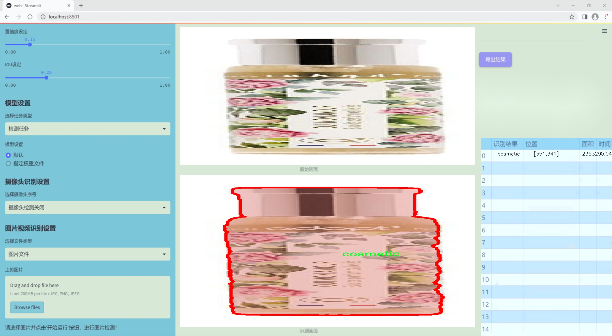

### 1.背景意义

研究背景与意义

随着计算机视觉技术的迅猛发展，实例分割在多个领域中展现出了巨大的应用潜力，尤其是在产品识别和图像分析方面。化妆品行业作为一个高度竞争且快速发展的市场，对产品识别和分类的需求日益增加。传统的图像处理方法往往无法满足现代化妆品行业对高精度、高效率的要求，因此，基于深度学习的实例分割技术逐渐成为解决这一问题的有效手段。

本研究旨在基于改进的YOLOv11模型，构建一个高效的化妆品实例分割系统。该系统将利用一个包含3700张图像的专用数据集，专注于化妆品这一单一类别的实例分割任务。通过对该数据集的深入分析和处理，我们期望能够提升模型在化妆品识别中的准确性和鲁棒性，从而为行业应用提供更为精准的技术支持。

在当前的市场环境中，消费者对化妆品的选择日益多样化，产品信息的获取和处理成为品牌竞争力的重要组成部分。通过实例分割技术，商家能够实现对产品图像的自动化分析，进而优化库存管理、提升用户体验、加强市场营销策略。因此，构建一个高效的化妆品实例分割系统，不仅具有重要的学术价值，也将为实际应用提供切实的支持。

此外，随着数据集的不断扩展和技术的不断进步，基于YOLOv11的实例分割系统将具备良好的可扩展性和适应性，能够在未来的研究中为其他类别的产品识别提供借鉴。综上所述，本研究不仅具有重要的理论意义，也将为化妆品行业的数字化转型提供有力的技术保障。

### 2.视频效果

[2.1 视频效果](https://www.bilibili.com/video/BV13hq6YvEmG/)

### 3.图片效果




##### [项目涉及的源码数据来源链接](https://kdocs.cn/l/cszuIiCKVNis)**

注意：本项目提供训练的数据集和训练教程,由于版本持续更新,暂不提供权重文件（best.pt）,请按照6.训练教程进行训练后实现上图演示的效果。

### 4.数据集信息

##### 4.1 本项目数据集类别数＆类别名

nc: 1
names: ['cosmetic']


该项目为【图像分割】数据集，请在【训练教程和Web端加载模型教程（第三步）】这一步的时候按照【图像分割】部分的教程来训练

##### 4.2 本项目数据集信息介绍

本项目数据集信息介绍

本项目所使用的数据集以“cosm2”为主题，专注于化妆品的实例分割任务。该数据集的设计旨在支持对化妆品对象的精确识别与分割，进而提升YOLOv11模型在化妆品检测和识别方面的性能。数据集中包含的类别数量为1，具体类别为“cosmetic”，这意味着数据集专注于化妆品这一单一类别的多样性和复杂性。

在数据集的构建过程中，我们收集了大量的化妆品图像，涵盖了不同品牌、类型和包装形式的产品。这些图像不仅包括化妆品的正面视图，还包括侧面、背面及不同光照条件下的拍摄，以确保模型能够在各种环境中进行有效的识别和分割。此外，数据集中的图像经过精心标注，确保每个化妆品对象的边界框和分割掩码准确无误，为模型的训练提供了高质量的输入。

为了提高模型的泛化能力，数据集中还包含了多种背景和场景，涵盖了家庭环境、化妆间、商店货架等多种使用场景。这种多样性不仅有助于模型学习到化妆品在不同环境中的特征，还能增强其在实际应用中的鲁棒性。

通过对该数据集的训练，期望能够显著提升YOLOv11在化妆品实例分割任务中的表现，使其能够更准确地识别和分割化妆品对象，为后续的应用开发奠定坚实的基础。该数据集的构建和应用，将为化妆品行业的智能化发展提供重要支持，推动相关技术的进步与创新。


### 5.全套项目环境部署视频教程（零基础手把手教学）

[5.1 所需软件PyCharm和Anaconda安装教程（第一步）](https://www.bilibili.com/video/BV1BoC1YCEKi/?spm_id_from=333.999.0.0&vd_source=bc9aec86d164b67a7004b996143742dc)


[5.2 安装Python虚拟环境创建和依赖库安装视频教程（第二步）](https://www.bilibili.com/video/BV1ZoC1YCEBw?spm_id_from=333.788.videopod.sections&vd_source=bc9aec86d164b67a7004b996143742dc)

### 6.改进YOLOv11训练教程和Web_UI前端加载模型教程（零基础手把手教学）

[6.1 改进YOLOv11训练教程和Web_UI前端加载模型教程（第三步）](https://www.bilibili.com/video/BV1BoC1YCEhR?spm_id_from=333.788.videopod.sections&vd_source=bc9aec86d164b67a7004b996143742dc)


按照上面的训练视频教程链接加载项目提供的数据集，运行train.py即可开始训练



     Epoch   gpu_mem       box       obj       cls    labels  img_size
     1/200     20.8G   0.01576   0.01955  0.007536        22      1280: 100%|██████████| 849/849 [14:42<00:00,  1.04s/it]
               Class     Images     Labels          P          R     mAP@.5 mAP@.5:.95: 100%|██████████| 213/213 [01:14<00:00,  2.87it/s]
                 all       3395      17314      0.994      0.957      0.0957      0.0843

     Epoch   gpu_mem       box       obj       cls    labels  img_size
     2/200     20.8G   0.01578   0.01923  0.007006        22      1280: 100%|██████████| 849/849 [14:44<00:00,  1.04s/it]
               Class     Images     Labels          P          R     mAP@.5 mAP@.5:.95: 100%|██████████| 213/213 [01:12<00:00,  2.95it/s]
                 all       3395      17314      0.996      0.956      0.0957      0.0845

     Epoch   gpu_mem       box       obj       cls    labels  img_size
     3/200     20.8G   0.01561    0.0191  0.006895        27      1280: 100%|██████████| 849/849 [10:56<00:00,  1.29it/s]
               Class     Images     Labels          P          R     mAP@.5 mAP@.5:.95: 100%|███████   | 187/213 [00:52<00:00,  4.04it/s]
                 all       3395      17314      0.996      0.957      0.0957      0.0845


###### [项目数据集下载链接](https://kdocs.cn/l/cszuIiCKVNis)

### 7.原始YOLOv11算法讲解


YOLO11 是 Ultralytics YOLO 系列的最新版本，结合了尖端的准确性、速度和效率，用于目标检测、分割、分类、定向边界框和姿态估计。与
YOLOv8 相比，它具有更少的参数和更好的结果，不难预见，YOLO11 在边缘设备上更高效、更快，将频繁出现在计算机视觉领域的最先进技术（SOTA）中。


**主要特点**

  * **增强的特征提取：**YOLO11 使用改进的主干和颈部架构来增强特征提取，以实现更精确的目标检测和复杂任务的性能。

  * **针对效率和速度优化：**精细的架构设计和优化的训练流程在保持准确性和性能之间最佳平衡的同时，提供更快的处理速度。

  * **更少的参数，更高的准确度：**YOLO11m 在 COCO 数据集上实现了比 YOLOv8m 更高的 mAP，参数减少了 22%，提高了计算效率，同时不牺牲准确度。

  * **跨环境的适应性：**YOLO11 可以无缝部署在边缘设备、云平台和配备 NVIDIA GPU 的系统上，确保最大的灵活性。

  * **支持广泛的任务范围：**YOLO11 支持各种计算机视觉任务，如目标检测、实例分割、图像分类、姿态估计和定向目标检测（OBB）。


### 8.200+种全套改进YOLOV11创新点原理讲解

#### 8.1 200+种全套改进YOLOV11创新点原理讲解大全

由于篇幅限制，每个创新点的具体原理讲解就不全部展开，具体见下列网址中的改进模块对应项目的技术原理博客网址【Blog】（创新点均为模块化搭建，原理适配YOLOv5~YOLOv11等各种版本）

[改进模块技术原理博客【Blog】网址链接](https://gitee.com/qunmasj/good)


#### 8.2 精选部分改进YOLOV11创新点原理讲解

###### 这里节选部分改进创新点展开原理讲解(完整的改进原理见上图和[改进模块技术原理博客链接](https://gitee.com/qunmasj/good)【如果此小节的图加载失败可以通过CSDN或者Github搜索该博客的标题访问原始博客，原始博客图片显示正常】
### CBAM空间注意力机制
近年来，随着深度学习研究方向的火热，注意力机制也被广泛地应用在图像识别、语音识别和自然语言处理等领域，注意力机制在深度学习任务中发挥着举足轻重的作用。注意力机制借鉴于人类的视觉系统，例如，人眼在看到一幅画面时，会倾向于关注画面中的重要信息，而忽略其他可见的信息。深度学习中的注意力机制和人类视觉的注意力机制相似，通过扫描全局数据，从大量数据中选择出需要重点关注的、对当前任务更为重要的信息，然后对这部分信息分配更多的注意力资源，从这些信息中获取更多所需要的细节信息，而抑制其他无用的信息。而在深度学习中，则具体表现为给感兴趣的区域更高的权重，经过网络的学习和调整，得到最优的权重分配，形成网络模型的注意力，使网络拥有更强的学习能力，加快网络的收敛速度。
注意力机制通常可分为软注意力机制和硬注意力机制[4-5]。软注意力机制在选择信息时，不是从输入的信息中只选择1个，而会用到所有输入信息，只是各个信息对应的权重分配不同，然后输入网络模型进行计算;硬注意力机制则是从输入的信息中随机选取一个或者选择概率最高的信息，但是这一步骤通常是不可微的，导致硬注意力机制更难训练。因此，软注意力机制应用更为广泛，按照原理可将软注意力机制划分为:通道注意力机制（channel attention)、空间注意力机制(spatial attention）和混合域注意力机制(mixed attention)。
通道注意力机制的本质建立各个特征通道之间的重要程度，对感兴趣的通道进行重点关注，弱化不感兴趣的通道的作用;空间注意力的本质则是建模了整个空间信息的重要程度，然后对空间内感兴趣的区域进行重点关注，弱化其余非感兴趣区域的作用;混合注意力同时运用了通道注意力和空间注意力，两部分先后进行或并行，形成对通道特征和空间特征同时关注的注意力模型。

卷积层注意力模块(Convolutional Block Attention Module，CBAM）是比较常用的混合注意力模块，其先后集中了通道注意力模块和空间注意力模块，网络中加入该模块能有效提高网络性能，减少网络模型的计算量，模块结构如图所示。输入特征图首先经过分支的通道注意力模块，然后和主干的原特征图融合，得到具有通道注意力的特征图，接着经过分支的空间注意力模块，在和主干的特征图融合后，得到同时具有通道特征注意力和空间特征注意力的特征图。CBAM模块不改变输入特征图的大小，因此该模块是一个“即插即用”的模块，可以插入网络的任何位置。

通道注意力模块的结构示意图如图所示，通道注意力模块分支并行地对输入的特征图进行最大池化操作和平均池化操作，然后利用多层感知机对结果进行变换，得到应用于两个通道的变换结果，最后经过sigmoid激活函数将变换结果融合，得到具有通道注意力的通道特征图。

空间注意力模块示意图如图所示，将通道注意力模块输出的特征图作为该模块的输入特征图，首先对输入特征图进行基于通道的最大池化操作和平均池化操作，将两部分得到的结果拼接起来，然后通过卷积得到降为Ⅰ通道的特征图，最后通过sigmoid激活函数生成具有空间注意力的特征图。


### 9.系统功能展示

图9.1.系统支持检测结果表格显示

  图9.2.系统支持置信度和IOU阈值手动调节

  图9.3.系统支持自定义加载权重文件best.pt(需要你通过步骤5中训练获得)

  图9.4.系统支持摄像头实时识别

  图9.5.系统支持图片识别

  图9.6.系统支持视频识别

  图9.7.系统支持识别结果文件自动保存

  图9.8.系统支持Excel导出检测结果数据


### 10. YOLOv11核心改进源码讲解

#### 10.1 hcfnet.py

以下是对给定代码的核心部分进行分析和注释的结果：

```python
import math
import torch
import torch.nn as nn
import torch.nn.functional as F

# 定义空间注意力模块
class SpatialAttentionModule(nn.Module):
    def __init__(self):
        super(SpatialAttentionModule, self).__init__()
        # 2通道输入，1通道输出的卷积层
        self.conv2d = nn.Conv2d(in_channels=2, out_channels=1, kernel_size=7, stride=1, padding=3)
        self.sigmoid = nn.Sigmoid()  # Sigmoid激活函数

    def forward(self, x):
        # 计算输入x的平均值和最大值
        avgout = torch.mean(x, dim=1, keepdim=True)  # 在通道维度上取平均
        maxout, _ = torch.max(x, dim=1, keepdim=True)  # 在通道维度上取最大值
        out = torch.cat([avgout, maxout], dim=1)  # 将平均值和最大值拼接
        out = self.sigmoid(self.conv2d(out))  # 通过卷积和Sigmoid激活
        return out * x  # 乘以输入x，得到加权后的输出

# 定义局部全局注意力模块
class LocalGlobalAttention(nn.Module):
    def __init__(self, output_dim, patch_size):
        super().__init__()
        self.output_dim = output_dim
        self.patch_size = patch_size
        self.mlp1 = nn.Linear(patch_size * patch_size, output_dim // 2)  # MLP层
        self.norm = nn.LayerNorm(output_dim // 2)  # 层归一化
        self.mlp2 = nn.Linear(output_dim // 2, output_dim)  # MLP层
        self.conv = nn.Conv2d(output_dim, output_dim, kernel_size=1)  # 1x1卷积
        self.prompt = torch.nn.parameter.Parameter(torch.randn(output_dim, requires_grad=True))  # 可学习的参数
        self.top_down_transform = torch.nn.parameter.Parameter(torch.eye(output_dim), requires_grad=True)  # 可学习的变换矩阵

    def forward(self, x):
        x = x.permute(0, 2, 3, 1)  # 变换维度顺序
        B, H, W, C = x.shape  # 获取批次大小、高度、宽度和通道数
        P = self.patch_size

        # 局部分支
        local_patches = x.unfold(1, P, P).unfold(2, P, P)  # 获取局部补丁
        local_patches = local_patches.reshape(B, -1, P * P, C)  # 重塑形状
        local_patches = local_patches.mean(dim=-1)  # 在通道维度上取平均

        local_patches = self.mlp1(local_patches)  # 通过第一个MLP
        local_patches = self.norm(local_patches)  # 归一化
        local_patches = self.mlp2(local_patches)  # 通过第二个MLP

        local_attention = F.softmax(local_patches, dim=-1)  # 计算局部注意力
        local_out = local_patches * local_attention  # 加权输出

        # 计算余弦相似度并生成掩码
        cos_sim = F.normalize(local_out, dim=-1) @ F.normalize(self.prompt[None, ..., None], dim=1)  # 计算余弦相似度
        mask = cos_sim.clamp(0, 1)  # 限制在[0, 1]范围内
        local_out = local_out * mask  # 应用掩码
        local_out = local_out @ self.top_down_transform  # 应用变换

        # 恢复形状并输出
        local_out = local_out.reshape(B, H // P, W // P, self.output_dim)  # 恢复形状
        local_out = local_out.permute(0, 3, 1, 2)  # 变换维度顺序
        local_out = F.interpolate(local_out, size=(H, W), mode='bilinear', align_corners=False)  # 上采样
        output = self.conv(local_out)  # 通过卷积层

        return output

# 定义PPA模块
class PPA(nn.Module):
    def __init__(self, in_features, filters) -> None:
        super().__init__()
        self.skip = nn.Conv2d(in_features, filters, kernel_size=1)  # 跳跃连接
        self.c1 = nn.Conv2d(filters, filters, kernel_size=3, padding=1)  # 卷积层
        self.c2 = nn.Conv2d(filters, filters, kernel_size=3, padding=1)  # 卷积层
        self.c3 = nn.Conv2d(filters, filters, kernel_size=3, padding=1)  # 卷积层
        self.sa = SpatialAttentionModule()  # 空间注意力模块
        self.lga2 = LocalGlobalAttention(filters, 2)  # 局部全局注意力模块
        self.lga4 = LocalGlobalAttention(filters, 4)  # 局部全局注意力模块
        self.drop = nn.Dropout2d(0.1)  # Dropout层
        self.bn1 = nn.BatchNorm2d(filters)  # 批归一化
        self.silu = nn.SiLU()  # SiLU激活函数

    def forward(self, x):
        x_skip = self.skip(x)  # 跳跃连接
        x_lga2 = self.lga2(x_skip)  # 局部全局注意力
        x_lga4 = self.lga4(x_skip)  # 局部全局注意力
        x1 = self.c1(x)  # 第一个卷积
        x2 = self.c2(x1)  # 第二个卷积
        x3 = self.c3(x2)  # 第三个卷积
        # 合并多个特征
        x = x1 + x2 + x3 + x_skip + x_lga2 + x_lga4
        x = self.bn1(x)  # 批归一化
        x = self.sa(x)  # 空间注意力
        x = self.drop(x)  # Dropout
        x = self.silu(x)  # SiLU激活
        return x

# 定义DASI模块
class DASI(nn.Module):
    def __init__(self, in_features, out_features) -> None:
        super().__init__()
        self.tail_conv = nn.Conv2d(out_features, out_features, kernel_size=1)  # 尾部卷积
        self.conv = nn.Conv2d(out_features // 2, out_features // 4, kernel_size=1)  # 卷积层
        self.bns = nn.BatchNorm2d(out_features)  # 批归一化
        self.skips = nn.Conv2d(in_features[1], out_features, kernel_size=1)  # 跳跃连接
        self.skips_2 = nn.Conv2d(in_features[0], out_features, kernel_size=1)  # 跳跃连接
        self.skips_3 = nn.Conv2d(in_features[2], out_features, kernel_size=3, stride=2, dilation=2, padding=2)  # 跳跃连接
        self.silu = nn.SiLU()  # SiLU激活函数

    def forward(self, x_list):
        x_low, x, x_high = x_list  # 分离输入
        x_high = self.skips_3(x_high) if x_high is not None else None  # 跳跃连接
        x_low = self.skips_2(x_low) if x_low is not None else None  # 跳跃连接
        x = self.skips(x)  # 跳跃连接
        x_skip = x  # 保存跳跃连接的输出
        x = torch.chunk(x, 4, dim=1)  # 将x分成4个部分

        # 处理高低特征
        if x_high is None:
            x0 = self.conv(torch.cat((x[0], x_low[0]), dim=1)) if x_low is not None else x[0]
            x1 = self.conv(torch.cat((x[1], x_low[1]), dim=1)) if x_low is not None else x[1]
            x2 = self.conv(torch.cat((x[2], x_low[2]), dim=1)) if x_low is not None else x[2]
            x3 = self.conv(torch.cat((x[3], x_low[3]), dim=1)) if x_low is not None else x[3]
        elif x_low is None:
            x0 = self.conv(torch.cat((x[0], x_high[0]), dim=1))
            x1 = self.conv(torch.cat((x[1], x_high[1]), dim=1))
            x2 = self.conv(torch.cat((x[2], x_high[2]), dim=1))
            x3 = self.conv(torch.cat((x[3], x_high[3]), dim=1))
        else:
            x0 = self.bag(x_low[0], x_high[0], x[0])
            x1 = self.bag(x_low[1], x_high[1], x[1])
            x2 = self.bag(x_low[2], x_high[2], x[2])
            x3 = self.bag(x_low[3], x_high[3], x[3])

        x = torch.cat((x0, x1, x2, x3), dim=1)  # 合并特征
        x = self.tail_conv(x)  # 尾部卷积
        x += x_skip  # 加上跳跃连接
        x = self.bns(x)  # 批归一化
        x = self.silu(x)  # SiLU激活
        return x
```

### 代码分析总结
1. **空间注意力模块（SpatialAttentionModule）**：通过计算输入特征图的平均值和最大值，生成一个注意力权重图，然后与输入特征图相乘以实现特征增强。

2. **局部全局注意力模块（LocalGlobalAttention）**：通过对输入特征图进行局部补丁处理，提取局部特征，并结合全局特征生成加权输出，最终通过卷积层进行处理。

3. **PPA模块**：结合多个卷积层、空间注意力和局部全局注意力模块，进行特征融合和增强。

4. **DASI模块**：通过跳跃连接和卷积层对多尺度特征进行处理，结合高低特征以增强输出。

以上模块构成了一个复杂的神经网络结构，旨在提高特征提取和表示能力。

这个文件 `hcfnet.py` 定义了一些用于深度学习的模块，主要用于图像处理和特征提取。代码中包含多个类，每个类实现了特定的功能，以下是对这些类的逐一说明。

首先，`SpatialAttentionModule` 类实现了空间注意力机制。该模块通过计算输入特征图的平均值和最大值，生成一个注意力图。具体来说，它首先计算输入张量在通道维度上的平均值和最大值，然后将这两个结果拼接在一起，经过一个卷积层和 Sigmoid 激活函数，最终得到的注意力图会与输入特征图逐元素相乘，从而增强重要特征。

接下来是 `LocalGlobalAttention` 类，它结合了局部和全局特征的注意力机制。该模块首先将输入特征图进行形状变换，提取局部补丁，然后通过多层感知机（MLP）处理这些补丁，计算局部注意力。局部特征经过归一化后与一个可学习的提示向量进行余弦相似度计算，生成一个掩码，最后将局部特征与掩码相乘并通过一个变换矩阵进行调整。输出特征图的形状会被恢复，并通过双线性插值调整到原始大小，最后经过一个卷积层输出。

`ECA` 类实现了有效通道注意力机制。它根据输入通道数计算一个自适应的卷积核大小，并通过全局平均池化生成通道特征。然后使用一维卷积和 Sigmoid 激活函数生成通道注意力权重，最后将这些权重应用于输入特征图。

`PPA` 类是一个复杂的模块，结合了多个卷积层、空间注意力模块、有效通道注意力和局部全局注意力。它首先通过跳跃连接将输入特征传递到不同的卷积层，然后将不同的特征融合在一起，经过有效通道注意力和空间注意力的处理，最后通过 dropout、批归一化和激活函数进行输出。

`Bag` 类实现了一个简单的加权融合机制，输入三个特征图，通过一个边缘注意力计算得到的权重来加权融合这些特征图。

最后，`DASI` 类是一个集成模块，接收多个输入特征图，并通过跳跃连接和卷积层进行特征融合。它根据输入特征的不同情况，选择性地进行处理和融合，最终输出经过处理的特征图。

整体来看，这个文件实现了一些现代深度学习中常用的注意力机制和特征融合方法，适用于图像分类、目标检测等任务，能够有效地提取和增强特征信息。

#### 10.2 transformer.py

以下是经过简化和注释的核心代码部分：

```python
import torch
import torch.nn as nn
from functools import partial

# 导入自定义的规范化模块
from .prepbn import RepBN, LinearNorm
from ..modules.transformer import TransformerEncoderLayer

# 定义一个线性规范化的部分函数，使用LayerNorm和RepBN
ln = nn.LayerNorm
linearnorm = partial(LinearNorm, norm1=ln, norm2=RepBN, step=60000)

class TransformerEncoderLayer_RepBN(TransformerEncoderLayer):
    def __init__(self, c1, cm=2048, num_heads=8, dropout=0, act=..., normalize_before=False):
        # 初始化父类的构造函数
        super().__init__(c1, cm, num_heads, dropout, act, normalize_before)
        
        # 使用自定义的线性规范化
        self.norm1 = linearnorm(c1)
        self.norm2 = linearnorm(c1)

class AIFI_RepBN(TransformerEncoderLayer_RepBN):
    """定义AIFI变换器层。"""

    def __init__(self, c1, cm=2048, num_heads=8, dropout=0, act=nn.GELU(), normalize_before=False):
        """使用指定参数初始化AIFI实例。"""
        super().__init__(c1, cm, num_heads, dropout, act, normalize_before)

    def forward(self, x):
        """AIFI变换器层的前向传播。"""
        c, h, w = x.shape[1:]  # 获取输入张量的通道数、高度和宽度
        pos_embed = self.build_2d_sincos_position_embedding(w, h, c)  # 构建位置嵌入
        # 将输入张量从形状[B, C, H, W]展平为[B, HxW, C]
        x = super().forward(x.flatten(2).permute(0, 2, 1), pos=pos_embed.to(device=x.device, dtype=x.dtype))
        # 将输出张量恢复为原始形状[B, C, H, W]
        return x.permute(0, 2, 1).view([-1, c, h, w]).contiguous()

    @staticmethod
    def build_2d_sincos_position_embedding(w, h, embed_dim=256, temperature=10000.0):
        """构建2D正弦-余弦位置嵌入。"""
        assert embed_dim % 4 == 0, "嵌入维度必须是4的倍数"
        grid_w = torch.arange(w, dtype=torch.float32)  # 创建宽度的网格
        grid_h = torch.arange(h, dtype=torch.float32)  # 创建高度的网格
        grid_w, grid_h = torch.meshgrid(grid_w, grid_h, indexing="ij")  # 生成网格坐标
        pos_dim = embed_dim // 4  # 计算位置维度
        omega = torch.arange(pos_dim, dtype=torch.float32) / pos_dim  # 计算频率
        omega = 1.0 / (temperature**omega)  # 应用温度缩放

        # 计算宽度和高度的正弦和余弦值
        out_w = grid_w.flatten()[..., None] @ omega[None]
        out_h = grid_h.flatten()[..., None] @ omega[None]

        # 返回组合的正弦和余弦位置嵌入
        return torch.cat([torch.sin(out_w), torch.cos(out_w), torch.sin(out_h), torch.cos(out_h)], 1)[None]
```

### 代码说明：
1. **导入模块**：引入必要的PyTorch模块和自定义的规范化模块。
2. **部分函数定义**：使用`functools.partial`定义一个线性规范化的部分函数，便于后续使用。
3. **TransformerEncoderLayer_RepBN类**：继承自`TransformerEncoderLayer`，并在初始化中添加了自定义的规范化层。
4. **AIFI_RepBN类**：定义了AIFI变换器层，包含前向传播和位置嵌入的构建方法。
5. **前向传播**：在`forward`方法中，处理输入数据并调用父类的前向传播方法，同时构建位置嵌入。
6. **位置嵌入构建**：`build_2d_sincos_position_embedding`方法用于生成2D正弦-余弦位置嵌入，适用于变换器模型的输入数据。

这个程序文件定义了一个基于Transformer架构的编码器层，主要使用了改进的归一化方法。首先，文件导入了必要的PyTorch库和模块，包括神经网络模块、功能模块以及一些自定义的归一化类和Transformer编码器层。

在文件中，定义了一个名为`TransformerEncoderLayer_RepBN`的类，它继承自`TransformerEncoderLayer`。这个类的构造函数接受多个参数，包括输入通道数、特征图的宽度和高度、头数、丢弃率、激活函数和是否在前面进行归一化。构造函数调用了父类的构造函数，并使用`linearnorm`函数创建了两个归一化层，分别用于后续的处理。

接下来，定义了一个名为`AIFI_RepBN`的类，它继承自`TransformerEncoderLayer_RepBN`，表示一个特定的Transformer层。这个类的构造函数同样接受多个参数，并在初始化时调用父类的构造函数。

在`AIFI_RepBN`类中，重写了`forward`方法，负责前向传播。首先，从输入张量`x`中提取出通道数、高度和宽度。然后，调用`build_2d_sincos_position_embedding`方法生成二维的正弦-余弦位置嵌入，并将输入张量进行形状变换，方便后续的处理。最后，经过父类的`forward`方法处理后，再将输出张量的形状调整回原来的格式。

`build_2d_sincos_position_embedding`是一个静态方法，用于构建二维的正弦-余弦位置嵌入。该方法首先检查嵌入维度是否能被4整除，以确保可以正确生成位置嵌入。接着，创建了宽度和高度的网格，并计算出对应的正弦和余弦值，最终返回一个包含这些位置嵌入的张量。

总体而言，这个文件实现了一个基于Transformer的编码器层，结合了自定义的归一化方法和位置嵌入，适用于处理图像等二维数据。

#### 10.3 head.py

以下是经过简化和注释的核心代码部分，主要集中在 `Detect_DyHead` 类及其相关方法。该类实现了 YOLOv8 的检测头，使用动态头（DyHead）进行目标检测。

```python
import torch
import torch.nn as nn
import math

class Detect_DyHead(nn.Module):
    """YOLOv8 检测头，使用动态头（DyHead）进行目标检测。"""
    
    def __init__(self, nc=80, hidc=256, block_num=2, ch=()):
        """
        初始化检测头的参数。
        
        参数:
        nc (int): 类别数量。
        hidc (int): 隐藏层通道数。
        block_num (int): 动态头块的数量。
        ch (tuple): 输入通道数。
        """
        super().__init__()
        self.nc = nc  # 类别数量
        self.nl = len(ch)  # 检测层数量
        self.reg_max = 16  # DFL 通道数
        self.no = nc + self.reg_max * 4  # 每个锚点的输出数量
        self.stride = torch.zeros(self.nl)  # 在构建过程中计算的步幅
        c2, c3 = max((16, ch[0] // 4, self.reg_max * 4)), max(ch[0], self.nc)  # 通道数
        self.conv = nn.ModuleList(nn.Sequential(Conv(x, hidc, 1)) for x in ch)  # 卷积层
        self.dyhead = nn.Sequential(*[DyHeadBlock(hidc) for _ in range(block_num)])  # 动态头块
        self.cv2 = nn.ModuleList(
            nn.Sequential(Conv(hidc, c2, 3), Conv(c2, c2, 3), nn.Conv2d(c2, 4 * self.reg_max, 1)) for _ in ch
        )  # 用于输出回归的卷积层
        self.cv3 = nn.ModuleList(
            nn.Sequential(
                nn.Sequential(DWConv(hidc, x, 3), Conv(x, c3, 1)),
                nn.Sequential(DWConv(c3, c3, 3), Conv(c3, c3, 1)),
                nn.Conv2d(c3, self.nc, 1),
            )
            for x in ch
        )  # 用于输出类别的卷积层
        self.dfl = DFL(self.reg_max) if self.reg_max > 1 else nn.Identity()  # DFL层

    def forward(self, x):
        """连接并返回预测的边界框和类别概率。"""
        for i in range(self.nl):
            x[i] = self.conv[i](x[i])  # 通过卷积层处理输入
        x = self.dyhead(x)  # 通过动态头处理
        shape = x[0].shape  # 获取输出形状
        for i in range(self.nl):
            # 连接回归和类别输出
            x[i] = torch.cat((self.cv2[i](x[i]), self.cv3[i](x[i])), 1)
        if self.training:
            return x  # 如果在训练模式，返回输出
        elif self.dynamic or self.shape != shape:
            # 动态锚点和步幅计算
            self.anchors, self.strides = (x.transpose(0, 1) for x in make_anchors(x, self.stride, 0.5))
            self.shape = shape

        # 将输出展平并分割为边界框和类别
        x_cat = torch.cat([xi.view(shape[0], self.no, -1) for xi in x], 2)
        box, cls = x_cat.split((self.reg_max * 4, self.nc), 1)  # 分割为边界框和类别
        dbox = dist2bbox(self.dfl(box), self.anchors.unsqueeze(0), xywh=True, dim=1) * self.strides  # 解码边界框
        y = torch.cat((dbox, cls.sigmoid()), 1)  # 返回边界框和类别概率
        return y if self.export else (y, x)

    def bias_init(self):
        """初始化检测头的偏置，警告：需要步幅可用。"""
        for a, b, s in zip(self.cv2, self.cv3, self.stride):
            a[-1].bias.data[:] = 1.0  # 边界框偏置初始化
            b[-1].bias.data[:self.nc] = math.log(5 / self.nc / (640 / s) ** 2)  # 类别偏置初始化
```

### 代码注释说明
1. **类和方法注释**：每个类和方法都有详细的文档字符串，描述其功能和参数。
2. **变量注释**：重要变量的用途和含义都进行了注释，帮助理解代码逻辑。
3. **逻辑流程**：通过注释解释了每一步的处理逻辑，特别是在前向传播过程中，如何处理输入、生成输出以及动态锚点的计算。

这个文件 `head.py` 是一个实现 YOLOv8 检测头的 PyTorch 模块，主要用于目标检测、分割和姿态估计等任务。文件中定义了多个类，每个类代表一种不同的检测头，具有不同的结构和功能。

首先，文件导入了一些必要的库，包括 PyTorch 和一些自定义模块。然后，定义了一个 `__all__` 列表，列出了该模块中所有公开的类和函数，以便于外部调用。

接下来，定义了 `Detect_DyHead` 类，这是 YOLOv8 的检测头，使用了动态头（DyHead）结构。该类的构造函数接受类别数、隐藏通道数、块数和通道配置等参数。它初始化了一些必要的参数和层，包括卷积层、动态头块、DFL（Distribution Focal Loss）等。在 `forward` 方法中，输入特征经过一系列卷积和动态头处理后，输出预测的边界框和类别概率。

文件中还定义了其他多种检测头类，如 `Detect_DyHeadWithDCNV3`、`Detect_AFPN_P345`、`Detect_Efficient` 等，这些类继承自 `Detect_DyHead` 或 `Detect_AFPN_P345`，并根据不同的需求和结构进行了相应的修改。例如，`Detect_AFPN_P345` 使用了自适应特征金字塔网络（AFPN），而 `Detect_Efficient` 则实现了更高效的检测结构。

每个检测头类的 `forward` 方法负责处理输入特征并生成最终的预测结果。在训练模式下，返回的是特征图；在推理模式下，返回的是经过处理的边界框和类别概率。文件中还实现了一些辅助方法，如 `bias_init` 用于初始化偏置，`decode_bboxes` 用于解码边界框等。

此外，文件中还定义了一些特定于任务的检测头类，如 `Segment_Efficient`、`Pose_LSCD` 和 `OBB_LSCD`，这些类分别用于分割、姿态估计和旋转边界框检测，具有与目标检测类似的结构，但输出和处理方式有所不同。

总的来说，这个文件实现了 YOLOv8 检测模型的多个变种，提供了灵活的结构以适应不同的检测任务和需求。每个类都可以根据具体的应用场景进行扩展和修改，支持更复杂的模型设计和训练策略。

#### 10.4 prepbn.py

以下是经过简化并添加详细中文注释的核心代码部分：

```python
import torch
import torch.nn as nn

# 定义一个自定义的批量归一化类
class RepBN(nn.Module):
    def __init__(self, channels):
        super(RepBN, self).__init__()
        # 定义一个可学习的参数 alpha，初始值为 1
        self.alpha = nn.Parameter(torch.ones(1))
        # 定义一个一维批量归一化层
        self.bn = nn.BatchNorm1d(channels)

    def forward(self, x):
        # 将输入的维度进行转置，以适应 BatchNorm1d 的输入格式
        x = x.transpose(1, 2)
        # 进行批量归一化，并加上 alpha 乘以输入 x
        x = self.bn(x) + self.alpha * x
        # 再次转置回原来的维度
        x = x.transpose(1, 2)
        return x

# 定义一个线性归一化类
class LinearNorm(nn.Module):
    def __init__(self, dim, norm1, norm2, warm=0, step=300000, r0=1.0):
        super(LinearNorm, self).__init__()
        # 注册一些缓冲区，用于控制训练过程中的参数
        self.register_buffer('warm', torch.tensor(warm))  # 预热阶段的步数
        self.register_buffer('iter', torch.tensor(step))   # 当前迭代步数
        self.register_buffer('total_step', torch.tensor(step))  # 总步数
        self.r0 = r0  # 初始比例
        # 初始化两个归一化层
        self.norm1 = norm1(dim)
        self.norm2 = norm2(dim)

    def forward(self, x):
        if self.training:  # 如果处于训练模式
            if self.warm > 0:  # 如果还有预热步数
                self.warm.copy_(self.warm - 1)  # 减少预热步数
                x = self.norm1(x)  # 使用 norm1 进行归一化
            else:
                # 计算当前的比例 lamda
                lamda = self.r0 * self.iter / self.total_step
                if self.iter > 0:
                    self.iter.copy_(self.iter - 1)  # 减少迭代步数
                # 使用两个归一化层进行处理
                x1 = self.norm1(x)
                x2 = self.norm2(x)
                # 线性组合两个归一化的结果
                x = lamda * x1 + (1 - lamda) * x2
        else:
            # 如果不在训练模式，直接使用 norm2 进行归一化
            x = self.norm2(x)
        return x
```

### 代码说明：
1. **RepBN 类**：
   - 该类实现了一个自定义的批量归一化层，除了标准的批量归一化外，还引入了一个可学习的参数 `alpha`，用于调整输入的影响。

2. **LinearNorm 类**：
   - 该类实现了一个线性归一化机制，支持在训练过程中根据预热阶段和迭代次数动态调整归一化的方式。
   - `norm1` 和 `norm2` 是两个不同的归一化方法，可以在训练过程中进行线性组合，以便更好地适应模型的学习。

通过这种设计，模型在训练初期可以使用一种归一化方式，随着训练的进行逐渐过渡到另一种方式，从而提高模型的稳定性和性能。

这个程序文件定义了两个神经网络模块，分别是 `RepBN` 和 `LinearNorm`，它们都是基于 PyTorch 框架构建的。

首先，`RepBN` 类是一个自定义的批量归一化模块。它的构造函数 `__init__` 接受一个参数 `channels`，用于指定输入数据的通道数。在构造函数中，定义了一个可学习的参数 `alpha`，并初始化为 1，同时创建了一个标准的 1D 批量归一化层 `bn`。在 `forward` 方法中，输入张量 `x` 首先进行了维度转换，将通道维和序列维进行交换，以适应批量归一化的要求。接着，经过批量归一化处理后，输出结果与 `alpha` 乘以原始输入 `x` 相加，最后再进行一次维度转换以恢复原来的形状。这个模块的设计目的是在进行批量归一化的同时，保留原始输入信息，从而可能提高模型的表现。

接下来是 `LinearNorm` 类，它实现了一种线性归一化策略。构造函数中接受多个参数，包括 `dim`（输入的维度）、`norm1` 和 `norm2`（分别是两种归一化方法的类），以及一些控制训练过程的参数如 `warm`、`step` 和 `r0`。在构造函数中，使用 `register_buffer` 方法注册了一些常量，以便在模型训练过程中使用。`forward` 方法中，首先检查模型是否处于训练模式。如果是，并且 `warm` 参数大于 0，则进行第一次归一化（`norm1`），并减少 `warm` 的值。否则，计算一个线性权重 `lamda`，这个权重随着训练的进行而变化，接着分别对输入 `x` 进行两种归一化处理（`norm1` 和 `norm2`），然后根据 `lamda` 的值将两者线性组合。若模型不在训练模式下，则直接使用 `norm2` 进行归一化。这个模块的设计意图是通过逐步过渡到另一种归一化方法，来提高模型的稳定性和性能。

总体来说，这个文件实现了两种自定义的神经网络层，分别用于改进批量归一化和实现动态归一化策略，旨在提升深度学习模型的训练效果和性能。

### 11.完整训练+Web前端界面+200+种全套创新点源码、数据集获取


# [下载链接：https://mbd.pub/o/bread/Z5yZkplp](https://mbd.pub/o/bread/Z5yZkplp)